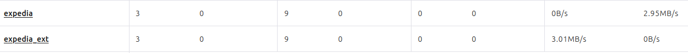
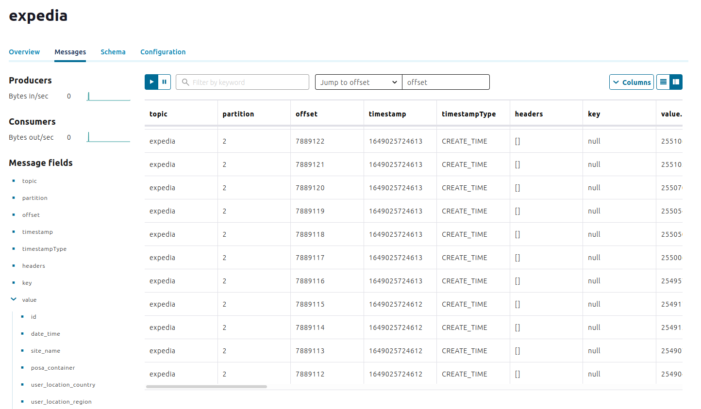
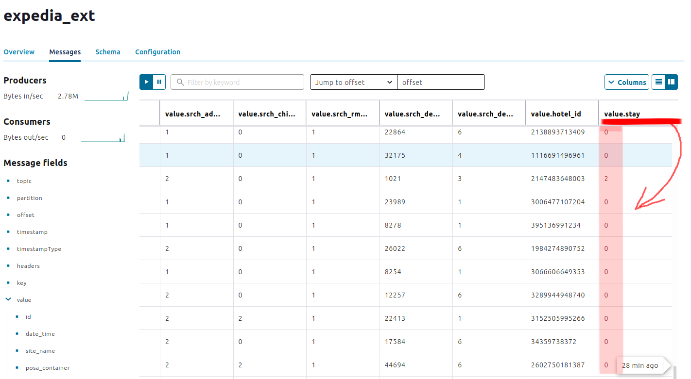
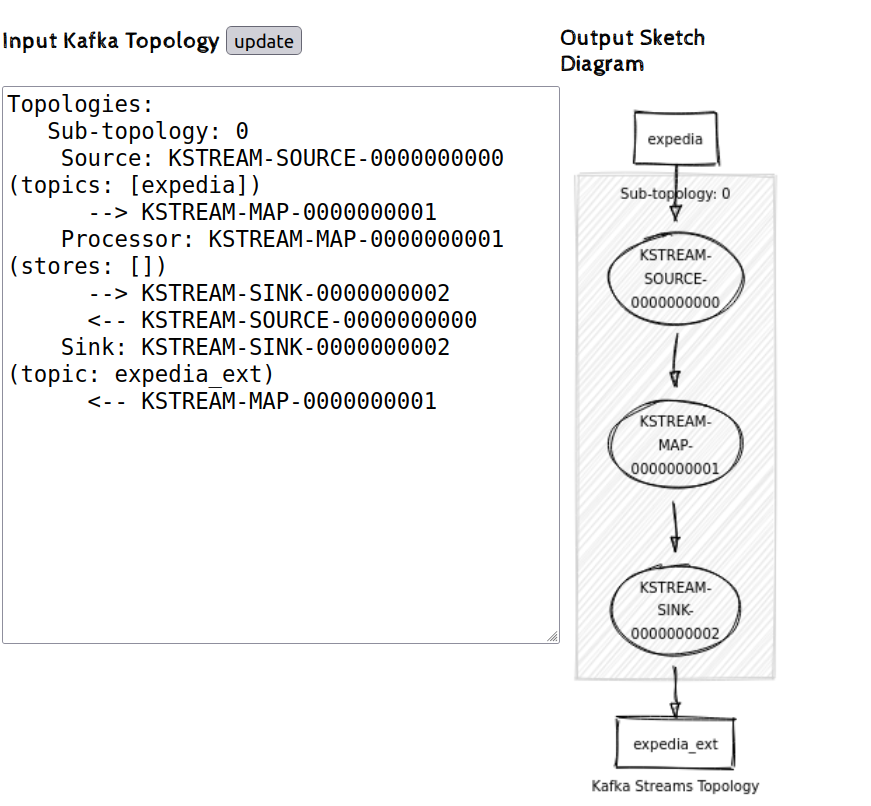
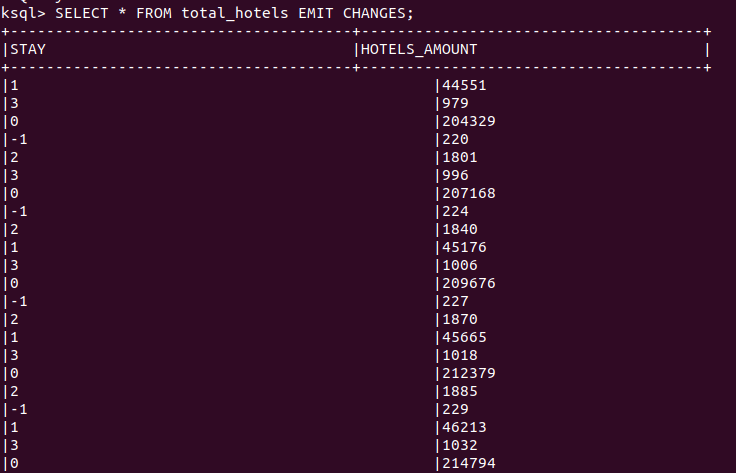
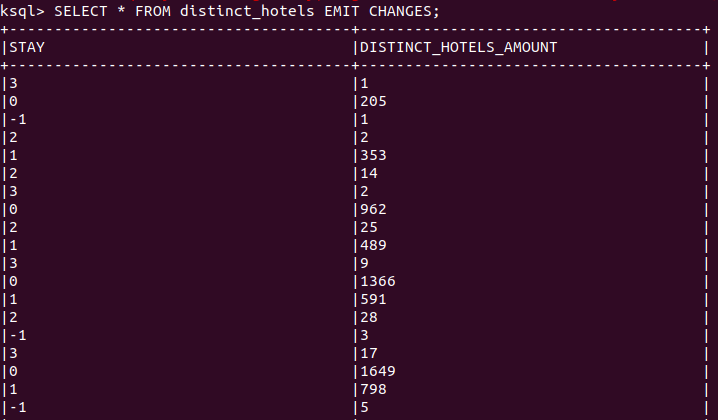
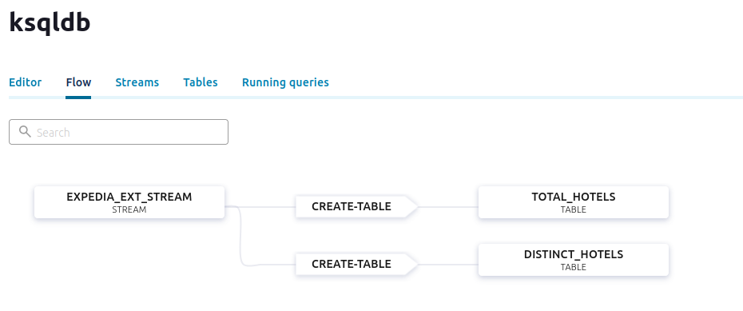

# Kafka connect in Kubernetes


## Create a custom docker image

```
FROM confluentinc/cp-server-connect-operator:6.1.4.0 AS base
USER root

RUN confluent-hub install --no-prompt confluentinc/kafka-connect-azure-blob-storage:1.6.6 \
&& confluent-hub install --no-prompt confluentinc/kafka-connect-azure-blob-storage-source:2.0.1

USER user
```

## Launch Confluent for Kubernetes

### Create a namespace

- Create the namespace to use:

  ```cmd
  kubectl create namespace confluent
  ```

- Set this namespace to default for your Kubernetes context:

  ```cmd
  kubectl config set-context --current --namespace confluent
  ```

### Configure Confluent for Kubernetes and create connector properties


```bash
#!/bin/bash

DOCKER_IMAGE="robertron01/connector-avals:1.0.0"

CONNECTOR_NAME="expedia"
CONNECTOR_CLASS="io.confluent.connect.azure.blob.storage.AzureBlobStorageSourceConnector"
TASKS_MAX="3"

FORMAT_CLASS="io.confluent.connect.azure.blob.storage.format.avro.AvroFormat"

TRANSFORMS="DateMask"
TRANSFORMS_DATEMASK_TYPE="org.apache.kafka.connect.transforms.MaskField\$Value"
TRANSFORMS_DATEMASK_FIELDS="date_time"
TRANSFORMS_DATEMASK_REPLACEMENT="0000-00-00 00:00:00"

RESOURCE_GROUP="rg-avals-westeurope"
CLUSTER_NAME="aks-avals-westeurope"

az_blob_account_name=""
az_blob_account_key=""
az_blob_container_name=""

if [ $# -ne 3 ]; then
    >&2 echo "usage: $0 'azure-blob-account-name' 'azure-blob-account-key' 'azure-blob-container-name'"
    exit 1
fi

az_blob_account_name=$1
az_blob_account_key=$2
az_blob_container_name=$3

az login

az aks get-credentials --resource-group $RESOURCE_GROUP --name $CLUSTER_NAME

kubectl create namespace confluent

kubectl config set-context --current --namespace confluent

helm repo add confluentinc https://packages.confluent.io/helm
helm repo update

helm upgrade --install confluent-operator confluentinc/confluent-for-kubernetes

docker build -t $DOCKER_IMAGE .
docker push $DOCKER_IMAGE

kubectl apply -f ./confluent-platform.yaml
kubectl apply -f ./producer-app-data.yaml

echo "
name=$CONNECTOR_NAME

connector.class=$CONNECTOR_CLASS
tasks.max=$TASKS_MAX
azblob.account.name=$az_blob_account_name
azblob.account.key=$az_blob_account_key
azblob.container.name=$az_blob_container_name
format.class=$FORMAT_CLASS

transforms=$TRANSFORMS
transforms.DateMask.type=$TRANSFORMS_DATEMASK_TYPE
transforms.DateMask.fields=$TRANSFORMS_DATEMASK_FIELDS
transforms.DateMask.replacement=$TRANSFORMS_DATEMASK_REPLACEMENT
" > connectors/azure-source-cc-expedia.properties
```

### View Control Center

- Set up port forwarding to Control Center web UI from local machine:

  ```cmd
  kubectl port-forward controlcenter-0 9021:9021
  ```

- Browse to Control Center: [http://localhost:9021](http://localhost:9021)

## Create a kafka topic



## Implement you KStream application

Code for adding new field `stay` with value:
- -1 for "Erroneous data": null, less than or equal to zero
- 0 for "Short stay": 1-4 days
- 1 for "Standard stay": 5-10 days
- 2 for "Standard extended stay": 11-14 days
- 3 for "Long stay": 2 weeks plus


```java
final String INPUT_TOPIC_NAME = "expedia";
final String OUTPUT_TOPIC_NAME = "expedia_ext";

final KStream<String, String> input_records = builder.stream(INPUT_TOPIC_NAME, Consumed.with(Serdes.String(), Serdes.String()));
input_records.map((key, value) -> new KeyValue<>(key, Utils.addStayField(value))).to(OUTPUT_TOPIC_NAME);
```

```java
private final static String DATE_REGEX = "^\\d{4}-\\d{2}-\\d{2}$";

    public static String addStayField(String value) {
        try {
            int flag = -1;
            ObjectMapper objectMapper = new ObjectMapper();
            Map<String, String> record = objectMapper.readValue(value, Map.class);

            String checkinString = record.get("srch_ci");
            String checkoutString = record.get("srch_co");

            if (checkinString != null && checkoutString != null && checkinString.matches(DATE_REGEX) && checkoutString.matches(DATE_REGEX)) {
                LocalDate checkinDate = LocalDate.parse(checkinString);
                LocalDate checkoutDate = LocalDate.parse(checkoutString);
                long stay = Duration.between(checkinDate.atStartOfDay(), checkoutDate.atStartOfDay()).toDays() + 1;

                if (stay >= 1 && stay <= 4) {
                    flag = 0;
                } else {
                    if (stay >= 5 && stay <= 10) {
                        flag = 1;
                    } else {
                        if (stay >= 11 && stay <= 14) {
                            flag = 2;
                        } else {
                            if (stay > 14) {
                                flag = 3;
                            }
                        }
                    }
                }
            }
            record.put("stay", String.valueOf(flag));
            return objectMapper.writeValueAsString(record);
        } catch (IOException e) {
            e.printStackTrace();
            return value;
        }
    }
```

## Script for application build and deploy

```bash
#!/bin/bash
mvn package

docker build -t robertron01/kfstream:latest .
docker push robertron01/kfstream:latest

kubectl delete -n confluent deployment kstream-app
kubectl apply -f ./kstream-app.yaml
```

## Work of application 

- Events in expedia topic 



- Events in expedia_ext topic(field `stay` highlighted)



- Kafka topology



## KSQL

- Create pod for ksql-cli with command

```bash
kubectl run tmp-ksql-cli --rm -i --tty --image confluentinc/cp-ksqldb-cli:6.1.0  http://ksqldb.confluent.svc.cluster.local:8088
```

- Run script to create stream and 2 tables

```sql
RUN SCRIPT 'create-connectors.sql';
```

- Script:

```sql
---------------------------------------------------------------------------------------------------
-- Create sources:
---------------------------------------------------------------------------------------------------
-- stream of hotels stay data:
CREATE STREAM expedia_ext_stream (
  	id BIGINT,
  	user_id BIGINT,
  	srch_ci VARCHAR,
  	srch_co VARCHAR,
  	hotel_id BIGINT,
  	stay INT
	) WITH (  
	  	kafka_topic='expedia_ext',
	 	value_format='json',
	  	partitions=3
 	);

-- total amount of distinct hotels by stay:
CREATE TABLE total_distinct_hotels AS
	SELECT stay, 
	       COUNT_DISTINCT(hotel_id) AS distinct_hotels_amount
	FROM expedia_ext_stream 
	WINDOW TUMBLING (SIZE 1 MINUTES)
	GROUP BY stay;

-- total amount of hotels by stay:
CREATE TABLE total_hotels AS
	SELECT stay,
	       COUNT(*) AS hotels_amount
	FROM expedia_ext_stream 
	WINDOW TUMBLING (SIZE 1 MINUTES)
	GROUP BY stay;
```

- Run statement to show data in tables





- Flow

